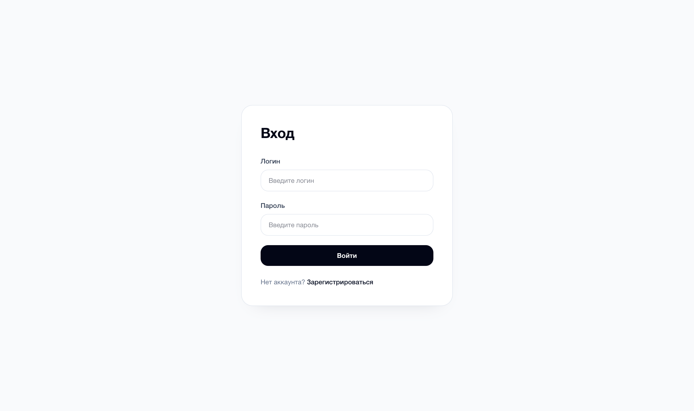
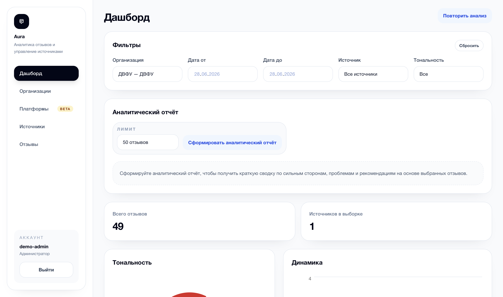
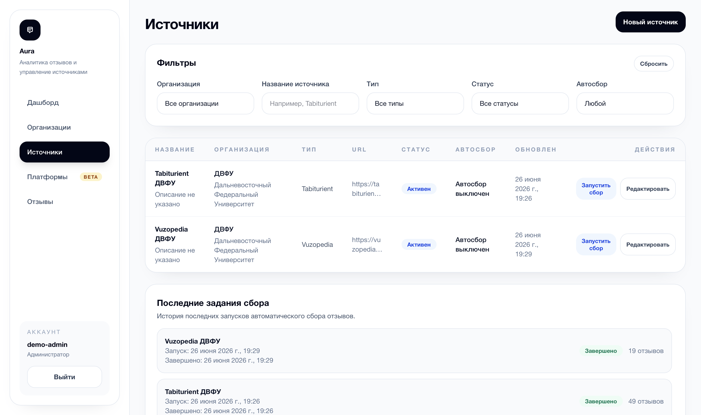
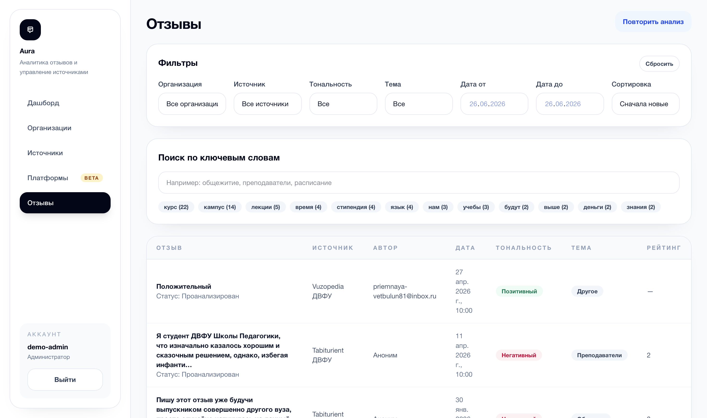
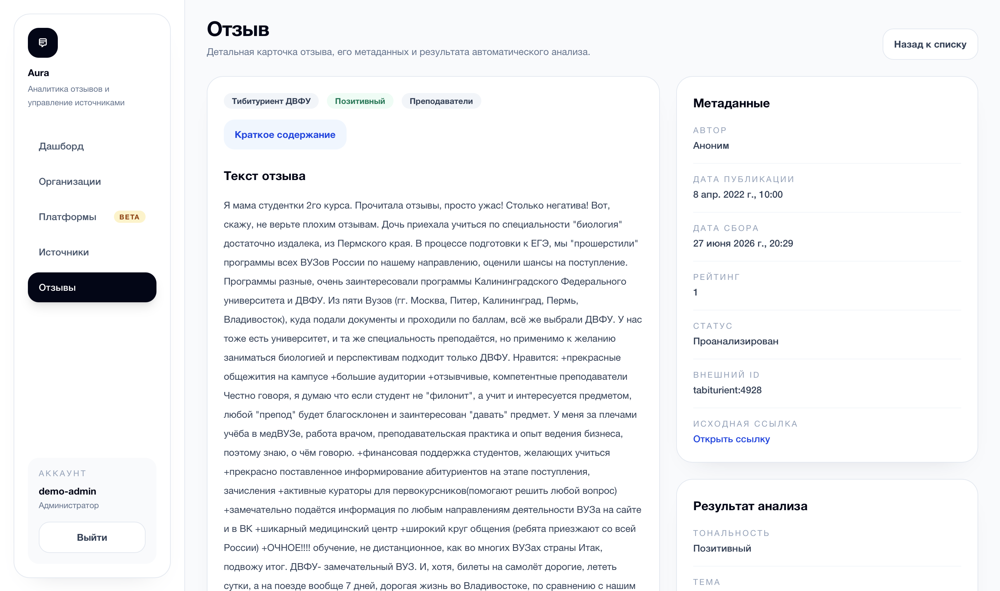
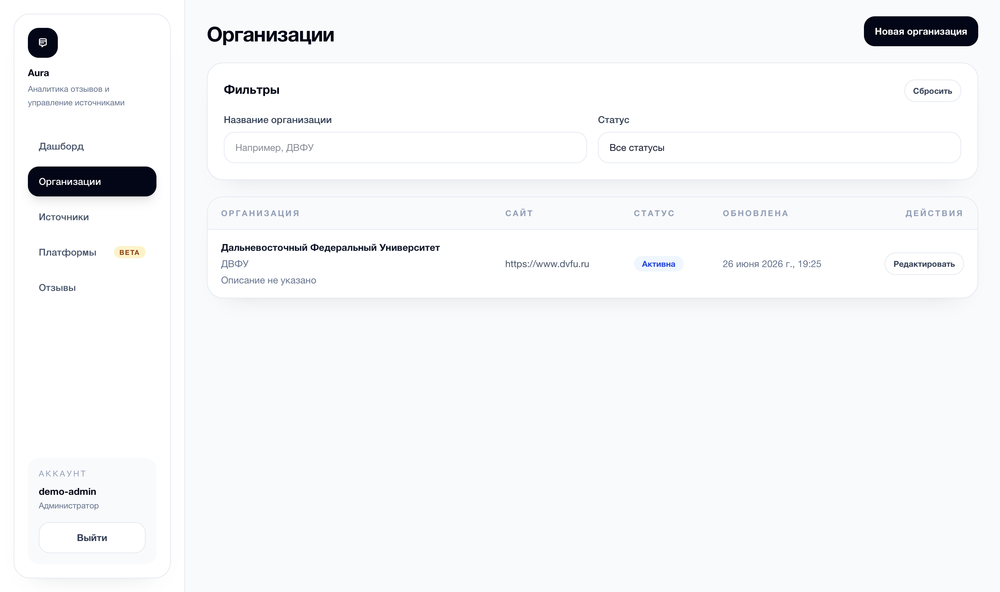

# Aura Monorepo

Монорепозиторий дипломного проекта по теме: "Разработка и реализация прототипа информационной системы автоматического сбора и интеллектуального анализа текстовых отзывов с использованием методов обработки естественного языка".

## Состав

- `aura-auth` - сервис аутентификации и авторизации на `Spring Boot` и `JWT`
- `aura-core` - основной backend для организаций, источников, отзывов и orchestration анализа
- `aura-analysis` - `FastAPI`-сервис интеллектуального анализа, summary и insights
- `aura-frontend` - web-интерфейс на `React`, `TypeScript` и `Vite`
- `aura-exception` - общий Spring Boot starter для унифицированной обработки ошибок

## Быстрый старт

1. Создайте локальный `.env` на основе `.env.example`:

```bash
cp .env.example .env
```

2. Запустите весь стек из корня:

```bash
docker compose up --build -d
```

3. Проверьте статус контейнеров:

```bash
docker compose ps
```

4. При необходимости дождитесь статуса `healthy` у `aura-analysis`, `aura-auth`, `aura-core`, `aura-frontend`.

## Доступные сервисы

- frontend: `http://localhost:5173`
- auth API: `http://localhost:8080`
- core API: `http://localhost:8081`
- analysis API: `http://localhost:8090`

Демо-администратор создаётся только если в `.env` включён bootstrap:

- login: `demo-admin`
- password: `demo123`

Поведение bootstrap:

- пользователь создаётся только на чистой БД
- при повторном старте с уже существующим volume повторное создание не выполняется
- если нужно заново получить demo-администратора, сначала удалите volumes

## Структура запуска

Корневой `docker-compose.yml` поднимает:

- `aura-auth-db` - PostgreSQL для `aura-auth`
- `aura-core-db` - PostgreSQL для `aura-core`
- `aura-auth` - auth backend
- `aura-core` - основной backend
- `aura-analysis` - NLP/AI backend
- `aura-frontend` - SPA через `nginx`

Это единственный поддерживаемый `docker compose` сценарий для монорепозитория. Внутренние compose-файлы сервисов не используются.

## Корневая Java-сборка

Корневой `pom.xml` поднимает единый Maven reactor для Java-модулей:

```bash
mvn -pl aura-auth/aura-auth-service -am package
mvn -pl aura-core/aura-core-service -am package
```

## Основные переменные окружения

В `.env.example` уже перечислены ключевые override-переменные:

- `JWT_PRIVATE_KEY`, `JWT_PUBLIC_KEY`, `JWT_ISSUER`
- `AUTH_DB_*`, `CORE_DB_*`
- `BOOTSTRAP_ADMIN_ENABLED`, `BOOTSTRAP_ADMIN_LOGIN`, `BOOTSTRAP_ADMIN_PASSWORD`
- `GOOGLE_AI_API_KEY`, `GOOGLE_AI_MODEL`
- `VITE_API_BASE_URL`, `VITE_AUTH_BASE_URL`

Demo RSA keypair и demo-учётные данные в `.env.example` предназначены только для локального запуска и демонстрации дипломного проекта.

Отдельные `.env` внутри сервисов в монорепозитории не используются. Основной сценарий запуска поддерживается только через корневой `.env`.

## Полезные команды

Остановить стек:

```bash
docker compose down
```

Остановить стек и удалить volumes, чтобы заново пройти bootstrap demo-данных:

```bash
docker compose down -v
```

Пересобрать и поднять заново:

```bash
docker compose up --build -d
```

Посмотреть логи:

```bash
docker compose logs -f
```

## Что Проверить После Старта

- `http://localhost:5173` открывает frontend
- `http://localhost:8080/actuator/health` возвращает health auth-сервиса
- `http://localhost:8081/actuator/health` возвращает health core-сервиса
- `http://localhost:8090/health` возвращает health analysis-сервиса
- вход под `demo-admin / demo123` работает, если bootstrap включён и БД была чистой

## Скриншоты Реализации

Ниже приведены основные экраны пользовательского интерфейса системы.

<table>
  <tr>
    <td align="center" width="33%">
      
      <br />
      <strong>Авторизация</strong>
      <br />
      Вход администратора или аналитика в систему
    </td>
    <td align="center" width="33%">
      
      <br />
      <strong>Дашборд</strong>
      <br />
      Сводная аналитика по отзывам и организациям
    </td>
    <td align="center" width="33%">
      
      <br />
      <strong>Источники</strong>
      <br />
      Управление источниками сбора отзывов
    </td>
  </tr>
  <tr>
    <td align="center" width="33%">
      
      <br />
      <strong>Отзывы</strong>
      <br />
      Просмотр, фильтрация и анализ отзывов
    </td>
    <td align="center" width="33%">
      
      <br />
      <strong>Карточка отзыва</strong>
      <br />
      Полный текст, метаданные, summary и результат анализа
    </td>
    <td align="center" width="33%">
      
      <br />
      <strong>Организации</strong>
      <br />
      Список организаций и контекст аналитики по ним
    </td>
  </tr>
</table>

## Документация по сервисам

- [aura-auth](./aura-auth/README.md)
- [aura-core](./aura-core/README.md)
- [aura-core-service](./aura-core/aura-core-service/README.md)
- [aura-analysis](./aura-analysis/README.md)
- [aura-frontend](./aura-frontend/README.md)
- [aura-exception](./aura-exception/README.md)
